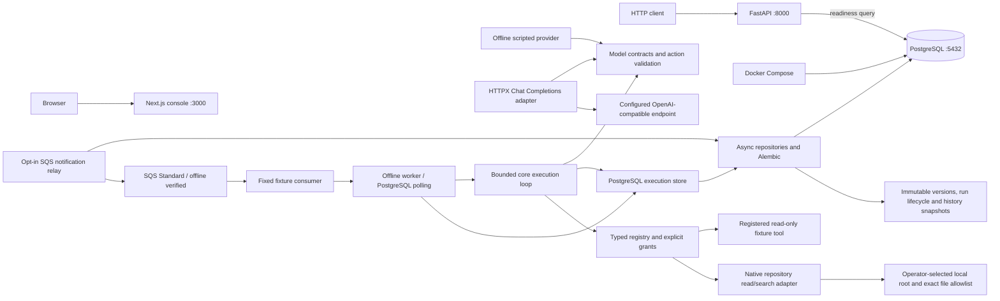
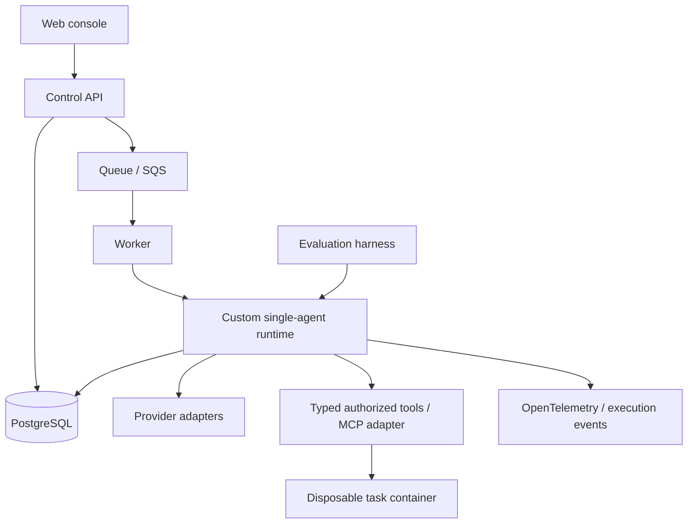

# Architecture

## Implemented through Phase 5J

Both applications expose `GET /health` with a typed/structured service identity.
These endpoints report liveness. The API also has `/ready`, a bounded database
connectivity probe. PostgreSQL has its own Compose health check. Schema migration
is an explicit operation. The web console remains the Phase 0 foundation; there
are no domain HTTP endpoints or web-to-API requests yet.

The root uv workspace locks Python dependencies in `uv.lock`; the API uses a src
layout and is installed as a real package. The npm workspace uses one root lockfile.
Python 3.12 and Node 24 are the initial supported interpreter lines. Explicit
minor-version adoption is preferred to untested claims of support for all future
Python versions. FastAPI/Pydantic and Next.js/React/TypeScript/Tailwind establish
the app boundaries. Ruff, strict mypy, ESLint, strict TypeScript, Prettier, pytest,
Vitest and process smoke checks form the quality baseline.

## Frozen initial boundaries

- Python backend; PostgreSQL is the future system of record.
- Build the runtime directly, initially for one agent per run.
- Next.js is the console; the runtime remains independent of UI concerns.
- Docker provides local dependencies and later controlled task environments.
- AWS is the deployment target, with Terraform managing infrastructure.
- No agent behavior, provider calls, tools, authentication or cloud deployment in Phase 0.

See [ADR 0001](docs/adr/0001-custom-runtime.md) and
[ADR 0002](docs/adr/0002-foundation-boundaries.md).

## Target architecture — not implemented

The API will accept work rather than run long tasks within an HTTP request.
Runtime domain code belongs in `packages/agent_core`; providers, tool execution,
evaluation and observability receive separate packages only when cohesive
implementations exist. `apps/worker` owns PostgreSQL polling/profile integration
and the opt-in SQS notification adapter.
Dependency direction should point from apps and adapters toward domain contracts,
never from the domain toward FastAPI or Next.js.

Phase 1A adds `AgentDefinition`, immutable `AgentVersion` and `Run` snapshots in
`runveil_core`. Configuration is stored as opaque JSON without provider/tool
semantics. `runveil_persistence` owns SQLAlchemy mappings, psycopg async connections,
concrete repositories and Alembic migration 0001. The core imports neither the API
nor the persistence adapter. API lifecycle code owns and disposes its readiness engine.

Repository callers own transactions. Parent-row locks serialize version numbering;
run-row locks plus required expected revisions reject stale transitions. PostgreSQL
triggers enforce immutable versions and the same state graph as the domain. Store
creation, most recent transition, first start and terminal timestamps. See
[ADR 0003](docs/adr/0003-phase-1a-persistence.md) for the transition table and trade-offs.

Phase 1B adds immutable `RunStep`, `ExecutionEvent` and `Checkpoint` snapshots,
ORM tables and migration 0002. The run row serializes all repository boundary
writes. `record_step` checks both expected revision and event sequence, then writes
the step, two events and full checkpoint in the caller's transaction. Database
triggers append lifecycle events and assign event order, including direct SQL
lifecycle writes. Existing runs receive an explicitly incomplete snapshot baseline.
Read APIs use bounded cursor pagination and latest-checkpoint lookup. See
[ADR 0004](docs/adr/0004-execution-history.md) for the transaction and restore contract.

Checkpoint loading restores opaque versioned JSON state and its event watermark;
it does not resume execution. The current run may have advanced since that snapshot.
Phase 1C adds `ModelInvocation` and `ToolCall`: persisted request identities and
one-time outcomes. Both use the run's revision/sequence boundary. Completion writes
an outcome event, then a correlated step/checkpoint, and finalizes the record in
one transaction. Optional tool provenance references a succeeded model invocation
in the same run. Migration 0003 adds the two tables and integrity guards without
rewriting Phase 1B history. See [ADR 0005](docs/adr/0005-invocation-records.md).

A requested record is evidence of intent, not a worker claim or proof of dispatch.
Phase 1C deferred durable workers and general tool authorization to later phases.
No new packages or HTTP routes were needed for Phase 1C.

Phase 2A adds provider-neutral Pydantic contracts and an async `ModelProvider`
protocol in `runveil_core`. `ScriptedProvider` consumes detached response/error
fixtures without network or retries. Responses normalize content, finish reason,
nullable usage and latency. A separate validator accepts exactly one structured
`tool_call` or `finish`, rejecting malformed/incomplete output and unadvertised
tool names. This does not authorize tools or validate arguments against tool
schemas. Contract JSON fits Phase 1C invocation records without a migration;
an integration test commits intent, calls outside a transaction, validates, then
persists/restores the outcome and checkpoint. See
[ADR 0006](docs/adr/0006-model-contracts.md).

Phase 2B adds `runveil_providers`, with one OpenAI-compatible Chat Completions
adapter using HTTPX. Operator configuration and credentials remain outside core
requests and persistence. JSON mode and an explicit action-schema instruction
preserve Phase 2A's envelope; callers still validate actions. The adapter owns and
closes its client, makes no retries, disables redirects/environment proxy settings,
bounds request/response bodies and enforces a network deadline. Cancellation
propagates; failures expose fixed codes. The wire boundary retains only selected
response fields and normalizes refusal, truncation, usage and latency. Native tool
calling, streaming and vendor-specific capability negotiation are not implemented.
See [ADR 0007](docs/adr/0007-hosted-provider.md) and
[provider operations](docs/operations/MODELS.md). An opt-in live command is available;
manual hosted acceptance is complete, with
[user-reported evidence](docs/operations/PHASE_2B.md#subsequent-hosted-live-acceptance--complete).

Phase 3 adds a bounded loop and storage protocol in `runveil_core.runtime`, with a
`PostgresExecutionStore` adapter in the persistence package. It starts only queued
runs, validates pinned configuration and checkpoints initial context. Model and
fixed fixture-tool invocations consume a shared step bound. Every request commits
before dispatch; outcomes checkpoint full context and final/error state. Terminal
outcomes and lifecycle transitions share one transaction. Provider calls have a
deadline and occur outside transactions. Stale writes and task cancellation
propagate; interrupted executions are not resumed or retried. The one fixture tool
has no filesystem/network capability. Runtime checkpoint state can be restored for
inspection independently of execution. See [ADR 0008](docs/adr/0008-minimal-runtime.md)
and [runtime operations](docs/operations/RUNTIME.md). No migration or domain HTTP
endpoint was needed; the CLI demonstration uses the same persisted loop.

Phase 4A replaces fixed dispatch with `runveil_core.tools`: Pydantic-derived
input/output schemas, a typed native handler binding and registry, 64 KiB payload
bounds, safe error codes and cooperative tool deadlines. Runtime configuration
version 2 pins tool names/permissions; a separate operator policy must also grant
them. Both default to deny. Only READ + PURE/READ_ONLY bindings are executable.
Tool offers are filtered and dispatch rechecks policy; persisted calls use the
selected name and existing atomic outcome/event/checkpoint boundaries. The fixture
is the sole built-in tool. No migration, dependency or package is added. See
[ADR 0009](docs/adr/0009-typed-tool-dispatch.md). Repository tools and filesystem
boundaries remain Phase 4B; trusted in-process handlers are not sandboxed.

Phase 4B adds `runveil_tools` as a real adapter package, depending on core. The
operator supplies a root and exact file allowlist; model arguments cannot broaden
it. Descriptor-relative reads refuse symlinks, hard links, special files and
cross-device paths. File/scan/response limits bound UTF-8 reads and literal search;
I/O runs in threads with explicit descriptor ownership. Safe native resource errors
pass through the existing atomic failed-outcome path. No migration or configuration
schema change is needed. See [ADR 0010](docs/adr/0010-repository-read-tools.md) and
[repository operations](docs/operations/REPOSITORY_TOOLS.md). Live reads are not
revision-pinned snapshots or process isolation; cancellation stops waiting but
cannot kill a filesystem syscall.

Phase 5A adds durable job enrollment and leased ownership in migration 0004.
`apps/worker` polls PostgreSQL for the fixed `fixture-v1` profile. Run locks, claim
tokens and database-clock expiry fence every execution-store write; ordinary
unclaimed stores refuse enrolled runs. Runtime checkpoint version 2 retains the
next tool action and model provenance. A new owner resumes clean checkpoints;
unresolved intent is atomically failed as `execution_interrupted`, never replayed.
The context-driven offline provider survives process recreation. Existing runs
are not adopted; historical checkpoints remain inspectable. See
[ADR 0011](docs/adr/0011-durable-fixture-worker.md) and [worker operations](docs/operations/WORKER.md).

Phase 5B adds a job eligibility timestamp (migration 0005) and an opt-in offline
`fixture-retry-v1` profile. Configuration/checkpoint version 3 pins retry limits
and retains retry counts/source IDs. Core classifies known rate-limit failures
under an explicit operator grant; the store atomically persists the failed attempt,
backoff schedule, RETRYING transition and lease release. Due work resumes under a
new claim; retry request events link the prior failure. Unknown/uncertain failures
remain terminal. Version-2 profiles keep retries disabled. See
[ADR 0012](docs/adr/0012-persisted-model-retries.md).

Phase 5C adds immutable worker-job deadlines in migration 0006 and the offline
`fixture-budget-v1` profile. Configuration/checkpoint version 4 pins elapsed time
from first start, including retries and process downtime. Database-clock checks
fence request/outcome/schedule boundaries, and cooperative model/tool deadlines
shrink to remaining time. Expiry commits a failed outcome/checkpoint, budget event
and terminal transition. Expired backoff is selectable without stealing live
leases. See [ADR 0013](docs/adr/0013-durable-elapsed-budget.md).

Phase 5D adds version-5 reported-token accounting in immutable checkpoints and
`fixture-token-v1`. Model outcomes atomically retain input/output sums, attempt
counts and nullable latest usage. Missing usage blocks continuation; reported
limits stop execution after an attempt, before accepting its action. Failed and
uncertain attempts remain accounted across retries/restarts. No migration or
provider-specific tokenizer is added. See [ADR 0014](docs/adr/0014-durable-token-budget.md).

Phase 5E adds version-6 pinned linear USD pricing and exact cost estimates in
nano-USD. The immutable configuration binds rates to the provider/request model;
unknown or mismatched pricing is rejected. Checkpoint cost is derived from known
token components and carries unknown-attempt counts. Cost limits terminate before
accepting an action at the same post-attempt boundary as tokens; recovery verifies
stored cost against pinned rates. `fixture-cost-v1` uses synthetic usage/pricing.
No migration or live price lookup is needed. See [ADR 0015](docs/adr/0015-pinned-cost-budget.md).

Phase 5F adds a version-7 run-wide identical-tool limit. The store counts matching
name/JSONB arguments in immutable invocation history under existing locks, before
creating a tool intent. Exhaustion atomically records a failed checkpoint, budget
event and terminal transition, without another tool invocation. No counter table,
checkpoint counter or migration is needed. `fixture-loop-v1` deliberately repeats
a read-only call to demonstrate rejection. See [ADR 0016](docs/adr/0016-durable-repeated-tool-limit.md).

Phase 5G adds version-8 separate model/tool intent limits, counted from durable
invocation records before dispatch. Zero disables a kind; all attempt statuses
consume capacity. Successful completion at a limit remains valid. Otherwise
eligible retries without remaining model capacity fail atomically at the outcome
instead of scheduling backoff. The existing total-step and repeated-tool limits
remain active. `fixture-calls-v1` demonstrates exact-limit success. See
[ADR 0017](docs/adr/0017-durable-invocation-limits.md).

Phase 5H adds explicit immutable in-memory repository snapshots. Version 9 pins
root identity, selected paths/content and tool source/version fingerprints in the
agent configuration. Every worker start/recovery constructs a fresh snapshot and
compares the complete expected configuration before model/tool dispatch or history
writes. `repository-read-v1` uses a fixed offline provider with explicit root/files
and per-run selection. Reads/search use captured bytes even if disk contents change.
Recovery requires the same local root and selected content; no durable content
archive or migration is added. Existing live bindings remain available. See
[ADR 0018](docs/adr/0018-pinned-repository-recovery.md).

Phase 5I adds migration 0007's opt-in notification outbox and a boto3 SQS Standard
adapter for `fixture-calls-v1`. Queue destination and enrollment commit with the
run; message bodies contain only schema version/run ID. A separately leased relay
sends outside transactions and fences completion. Eligible jobs are re-notified
periodically until terminal, covering lost messages and expired execution leases.
Consumers validate queue/profile membership and use existing PostgreSQL claims;
only committed terminal state permits acknowledgement. Existing polling remains
available. Offline SDK stubs and database tests verify the consistency boundary;
no live AWS acceptance or infrastructure is claimed. See
[ADR 0019](docs/adr/0019-sqs-notification-outbox.md) and [broker operations](docs/operations/BROKER.md).

Phase 5J adds migration 0008's job admission state and separate append-only audit.
For `fixture-calls-v1`, explicit execution-start configuration rejections accumulate
under the live claim. Recording clears ownership and imposes a 30-second cooldown;
the third recorded rejection quarantines the job from polling and publication.
Runtime history/checkpoints and original deadlines remain unchanged. Operator
release checks the observed admission revision and supported pinned configuration
before auditing/resetting admission state. Unknown exceptions and uncertain
execution are not reclassified or replayed. See
[ADR 0020](docs/adr/0020-worker-admission-quarantine.md) and [admission operations](docs/operations/ADMISSION.md).

Broader broker operational hardening, general/hosted retries, richer billing models,
approvals and sandbox boundaries remain future slices.

## Open decisions

- Public product/repository name and license.
- Future additional provider profiles/capabilities.
- Broader admission failure classification and hosted retry/idempotency semantics.
- Sandbox threat model and AWS cost/deployment details.

These are reviewed in their relevant phase, not settled by empty abstractions.
