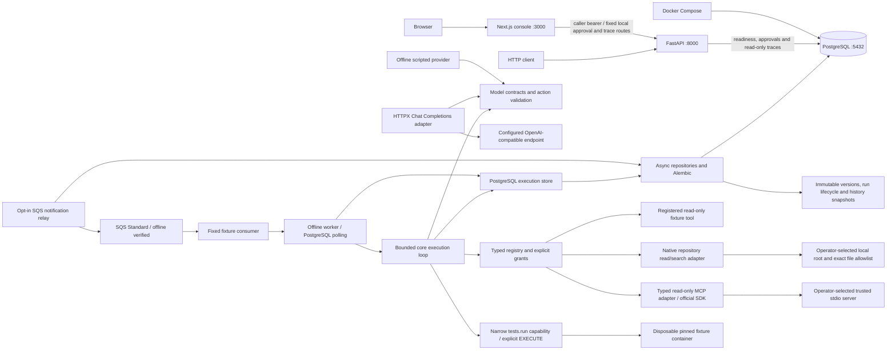
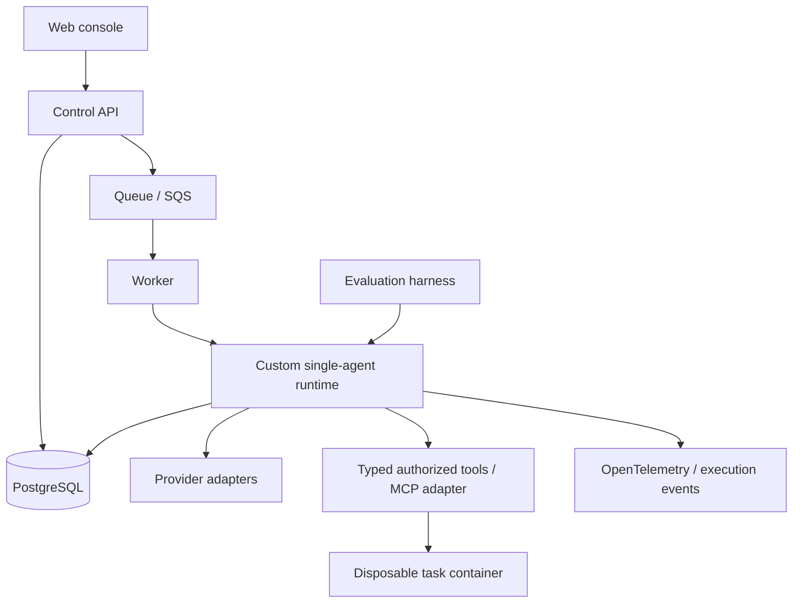

# Architecture

## Implemented through Phase 11B; pinned MCP worker review pending

Both applications expose `GET /health` with a typed/structured service identity.
These endpoints report liveness. The API also has `/ready`, a bounded database
connectivity probe. PostgreSQL has its own Compose health check. Schema migration
is an explicit operation. The web console exposes single-run approval inspection
and decisions through a bounded same-origin proxy to the local authenticated operator API.

The root uv workspace locks Python dependencies in `uv.lock`; the API uses a src
layout and is installed as a real package. The npm workspace uses one root lockfile.
Python 3.12 and Node 24 are the initial supported interpreter lines. Explicit
minor-version adoption is preferred to untested claims of support for all future
Python versions. FastAPI/Pydantic and Next.js/React/TypeScript/Tailwind establish
the app boundaries. Ruff, strict mypy, ESLint, strict TypeScript, Prettier, pytest,
Vitest and process smoke checks form the quality baseline.

## Frozen initial boundaries

- Python backend; PostgreSQL is the future system of record.
- Build the runtime directly, initially for one agent per run.
- Next.js is the console; the runtime remains independent of UI concerns.
- Docker provides local dependencies and later controlled task environments.
- AWS is the deployment target, with Terraform managing infrastructure.
- No agent behavior, provider calls, tools, authentication or cloud deployment in Phase 0.

See [ADR 0001](docs/adr/0001-custom-runtime.md) and
[ADR 0002](docs/adr/0002-foundation-boundaries.md).

## Target architecture — not implemented

The API will accept work rather than run long tasks within an HTTP request.
Runtime domain code belongs in `packages/agent_core`; providers, tool execution,
evaluation and observability receive separate packages only when cohesive
implementations exist. `apps/worker` owns PostgreSQL polling/profile integration
and the opt-in SQS notification adapter.
Dependency direction should point from apps and adapters toward domain contracts,
never from the domain toward FastAPI or Next.js.

Phase 1A adds `AgentDefinition`, immutable `AgentVersion` and `Run` snapshots in
`runveil_core`. Configuration is stored as opaque JSON without provider/tool
semantics. `runveil_persistence` owns SQLAlchemy mappings, psycopg async connections,
concrete repositories and Alembic migration 0001. The core imports neither the API
nor the persistence adapter. API lifecycle code owns and disposes its readiness engine.

Repository callers own transactions. Parent-row locks serialize version numbering;
run-row locks plus required expected revisions reject stale transitions. PostgreSQL
triggers enforce immutable versions and the same state graph as the domain. Store
creation, most recent transition, first start and terminal timestamps. See
[ADR 0003](docs/adr/0003-phase-1a-persistence.md) for the transition table and trade-offs.

Phase 1B adds immutable `RunStep`, `ExecutionEvent` and `Checkpoint` snapshots,
ORM tables and migration 0002. The run row serializes all repository boundary
writes. `record_step` checks both expected revision and event sequence, then writes
the step, two events and full checkpoint in the caller's transaction. Database
triggers append lifecycle events and assign event order, including direct SQL
lifecycle writes. Existing runs receive an explicitly incomplete snapshot baseline.
Read APIs use bounded cursor pagination and latest-checkpoint lookup. See
[ADR 0004](docs/adr/0004-execution-history.md) for the transaction and restore contract.

Checkpoint loading restores opaque versioned JSON state and its event watermark;
it does not resume execution. The current run may have advanced since that snapshot.
Phase 1C adds `ModelInvocation` and `ToolCall`: persisted request identities and
one-time outcomes. Both use the run's revision/sequence boundary. Completion writes
an outcome event, then a correlated step/checkpoint, and finalizes the record in
one transaction. Optional tool provenance references a succeeded model invocation
in the same run. Migration 0003 adds the two tables and integrity guards without
rewriting Phase 1B history. See [ADR 0005](docs/adr/0005-invocation-records.md).

A requested record is evidence of intent, not a worker claim or proof of dispatch.
Phase 1C deferred durable workers and general tool authorization to later phases.
No new packages or HTTP routes were needed for Phase 1C.

Phase 2A adds provider-neutral Pydantic contracts and an async `ModelProvider`
protocol in `runveil_core`. `ScriptedProvider` consumes detached response/error
fixtures without network or retries. Responses normalize content, finish reason,
nullable usage and latency. A separate validator accepts exactly one structured
`tool_call` or `finish`, rejecting malformed/incomplete output and unadvertised
tool names. This does not authorize tools or validate arguments against tool
schemas. Contract JSON fits Phase 1C invocation records without a migration;
an integration test commits intent, calls outside a transaction, validates, then
persists/restores the outcome and checkpoint. See
[ADR 0006](docs/adr/0006-model-contracts.md).

Phase 2B adds `runveil_providers`, with one OpenAI-compatible Chat Completions
adapter using HTTPX. Operator configuration and credentials remain outside core
requests and persistence. JSON mode and an explicit action-schema instruction
preserve Phase 2A's envelope; callers still validate actions. The adapter owns and
closes its client, makes no retries, disables redirects/environment proxy settings,
bounds request/response bodies and enforces a network deadline. Cancellation
propagates; failures expose fixed codes. The wire boundary retains only selected
response fields and normalizes refusal, truncation, usage and latency. Native tool
calling, streaming and vendor-specific capability negotiation are not implemented.
See [ADR 0007](docs/adr/0007-hosted-provider.md) and
[provider operations](docs/operations/MODELS.md). An opt-in live command is available;
manual hosted acceptance is complete, with
[user-reported evidence](docs/operations/PHASE_2B.md#subsequent-hosted-live-acceptance--complete).

Phase 3 adds a bounded loop and storage protocol in `runveil_core.runtime`, with a
`PostgresExecutionStore` adapter in the persistence package. It starts only queued
runs, validates pinned configuration and checkpoints initial context. Model and
fixed fixture-tool invocations consume a shared step bound. Every request commits
before dispatch; outcomes checkpoint full context and final/error state. Terminal
outcomes and lifecycle transitions share one transaction. Provider calls have a
deadline and occur outside transactions. Stale writes and task cancellation
propagate; interrupted executions are not resumed or retried. The one fixture tool
has no filesystem/network capability. Runtime checkpoint state can be restored for
inspection independently of execution. See [ADR 0008](docs/adr/0008-minimal-runtime.md)
and [runtime operations](docs/operations/RUNTIME.md). No migration or domain HTTP
endpoint was needed; the CLI demonstration uses the same persisted loop.

Phase 4A replaces fixed dispatch with `runveil_core.tools`: Pydantic-derived
input/output schemas, a typed native handler binding and registry, 64 KiB payload
bounds, safe error codes and cooperative tool deadlines. Runtime configuration
version 2 pins tool names/permissions; a separate operator policy must also grant
them. Both default to deny. Only READ + PURE/READ_ONLY bindings are executable.
Tool offers are filtered and dispatch rechecks policy; persisted calls use the
selected name and existing atomic outcome/event/checkpoint boundaries. The fixture
is the sole built-in tool. No migration, dependency or package is added. See
[ADR 0009](docs/adr/0009-typed-tool-dispatch.md). Repository tools and filesystem
boundaries remain Phase 4B; trusted in-process handlers are not sandboxed.

Phase 4B adds `runveil_tools` as a real adapter package, depending on core. The
operator supplies a root and exact file allowlist; model arguments cannot broaden
it. Descriptor-relative reads refuse symlinks, hard links, special files and
cross-device paths. File/scan/response limits bound UTF-8 reads and literal search;
I/O runs in threads with explicit descriptor ownership. Safe native resource errors
pass through the existing atomic failed-outcome path. No migration or configuration
schema change is needed. See [ADR 0010](docs/adr/0010-repository-read-tools.md) and
[repository operations](docs/operations/REPOSITORY_TOOLS.md). Live reads are not
revision-pinned snapshots or process isolation; cancellation stops waiting but
cannot kill a filesystem syscall.

Phase 5A adds durable job enrollment and leased ownership in migration 0004.
`apps/worker` polls PostgreSQL for the fixed `fixture-v1` profile. Run locks, claim
tokens and database-clock expiry fence every execution-store write; ordinary
unclaimed stores refuse enrolled runs. Runtime checkpoint version 2 retains the
next tool action and model provenance. A new owner resumes clean checkpoints;
unresolved intent is atomically failed as `execution_interrupted`, never replayed.
The context-driven offline provider survives process recreation. Existing runs
are not adopted; historical checkpoints remain inspectable. See
[ADR 0011](docs/adr/0011-durable-fixture-worker.md) and [worker operations](docs/operations/WORKER.md).

Phase 5B adds a job eligibility timestamp (migration 0005) and an opt-in offline
`fixture-retry-v1` profile. Configuration/checkpoint version 3 pins retry limits
and retains retry counts/source IDs. Core classifies known rate-limit failures
under an explicit operator grant; the store atomically persists the failed attempt,
backoff schedule, RETRYING transition and lease release. Due work resumes under a
new claim; retry request events link the prior failure. Unknown/uncertain failures
remain terminal. Version-2 profiles keep retries disabled. See
[ADR 0012](docs/adr/0012-persisted-model-retries.md).

Phase 5C adds immutable worker-job deadlines in migration 0006 and the offline
`fixture-budget-v1` profile. Configuration/checkpoint version 4 pins elapsed time
from first start, including retries and process downtime. Database-clock checks
fence request/outcome/schedule boundaries, and cooperative model/tool deadlines
shrink to remaining time. Expiry commits a failed outcome/checkpoint, budget event
and terminal transition. Expired backoff is selectable without stealing live
leases. See [ADR 0013](docs/adr/0013-durable-elapsed-budget.md).

Phase 5D adds version-5 reported-token accounting in immutable checkpoints and
`fixture-token-v1`. Model outcomes atomically retain input/output sums, attempt
counts and nullable latest usage. Missing usage blocks continuation; reported
limits stop execution after an attempt, before accepting its action. Failed and
uncertain attempts remain accounted across retries/restarts. No migration or
provider-specific tokenizer is added. See [ADR 0014](docs/adr/0014-durable-token-budget.md).

Phase 5E adds version-6 pinned linear USD pricing and exact cost estimates in
nano-USD. The immutable configuration binds rates to the provider/request model;
unknown or mismatched pricing is rejected. Checkpoint cost is derived from known
token components and carries unknown-attempt counts. Cost limits terminate before
accepting an action at the same post-attempt boundary as tokens; recovery verifies
stored cost against pinned rates. `fixture-cost-v1` uses synthetic usage/pricing.
No migration or live price lookup is needed. See [ADR 0015](docs/adr/0015-pinned-cost-budget.md).

Phase 5F adds a version-7 run-wide identical-tool limit. The store counts matching
name/JSONB arguments in immutable invocation history under existing locks, before
creating a tool intent. Exhaustion atomically records a failed checkpoint, budget
event and terminal transition, without another tool invocation. No counter table,
checkpoint counter or migration is needed. `fixture-loop-v1` deliberately repeats
a read-only call to demonstrate rejection. See [ADR 0016](docs/adr/0016-durable-repeated-tool-limit.md).

Phase 5G adds version-8 separate model/tool intent limits, counted from durable
invocation records before dispatch. Zero disables a kind; all attempt statuses
consume capacity. Successful completion at a limit remains valid. Otherwise
eligible retries without remaining model capacity fail atomically at the outcome
instead of scheduling backoff. The existing total-step and repeated-tool limits
remain active. `fixture-calls-v1` demonstrates exact-limit success. See
[ADR 0017](docs/adr/0017-durable-invocation-limits.md).

Phase 5H adds explicit immutable in-memory repository snapshots. Version 9 pins
root identity, selected paths/content and tool source/version fingerprints in the
agent configuration. Every worker start/recovery constructs a fresh snapshot and
compares the complete expected configuration before model/tool dispatch or history
writes. `repository-read-v1` uses a fixed offline provider with explicit root/files
and per-run selection. Reads/search use captured bytes even if disk contents change.
Recovery requires the same local root and selected content; no durable content
archive or migration is added. Existing live bindings remain available. See
[ADR 0018](docs/adr/0018-pinned-repository-recovery.md).

Phase 5I adds migration 0007's opt-in notification outbox and a boto3 SQS Standard
adapter for `fixture-calls-v1`. Queue destination and enrollment commit with the
run; message bodies contain only schema version/run ID. A separately leased relay
sends outside transactions and fences completion. Eligible jobs are re-notified
periodically until terminal, covering lost messages and expired execution leases.
Consumers validate queue/profile membership and use existing PostgreSQL claims;
only committed terminal state permits acknowledgement. Existing polling remains
available. Offline SDK stubs and database tests verify the consistency boundary;
no live AWS acceptance or infrastructure is claimed. See
[ADR 0019](docs/adr/0019-sqs-notification-outbox.md) and [broker operations](docs/operations/BROKER.md).

Phase 5J adds migration 0008's job admission state and separate append-only audit.
For `fixture-calls-v1`, explicit execution-start configuration rejections accumulate
under the live claim. Recording clears ownership and imposes a 30-second cooldown;
the third recorded rejection quarantines the job from polling and publication.
Runtime history/checkpoints and original deadlines remain unchanged. Operator
release checks the observed admission revision and supported pinned configuration
before auditing/resetting admission state. Unknown exceptions and uncertain
execution are not reclassified or replayed. See
[ADR 0020](docs/adr/0020-worker-admission-quarantine.md) and [admission operations](docs/operations/ADMISSION.md).

Phase 5K consolidates acceptance without changing runtime behavior. A disposable
PostgreSQL harness kills an actual worker process after a committed tool checkpoint
or intent, then drives the existing SQS consumer in fresh processes with offline
SDK stubs. It verifies successful continuation, conservative uncertain-intent failure,
active-lease deferral and terminal duplicate acknowledgement. Lease expiry is advanced
only inside the harness-owned database after verified process death. CI runs the
demonstration alongside the existing boundary tests. Phase 5 is ready for closure
review within the accepted scope; see the [acceptance audit](docs/operations/PHASE_5.md).

Broader broker operational hardening, general/hosted retries, richer billing models,
general approval integration and sandbox boundaries remain future slices.

## Open decisions

- Future additional provider profiles/capabilities.
- Broader admission failure classification and hosted retry/idempotency semantics.
- Sandbox threat model and AWS cost/deployment details.

These are reviewed in their relevant phase, not settled by empty abstractions.

## Phase 6A approval foundation

The dedicated `patch-review-v1` workflow persists one bounded single-file proposal
and its digest in migration 0009. Request, event, checkpoint and approval pause are
atomic. A trusted local operator resolves the exact proposal using the inspected
run revision and digest. Approval resumes only to checkpoint a completed review;
rejection terminates without resuming. Neither path invokes a model/tool or writes
a file. Immutable request identity and one-time outcome guards prevent replacement
or repeated decisions. Cancellation invalidates resolution.

This workflow refuses worker-enrolled runs and other version configurations.
Existing runtime checkpoint schemas, worker claims, budgets, retry/recovery and
read-only tool authorization remain unchanged. It deliberately does not claim
model-driven approval recovery, patch application, HTTP or UI support. See
[ADR 0021](docs/adr/0021-durable-patch-review.md) and
[approval operations](docs/operations/APPROVALS.md).

## Phase 6B worker approval integration

Configuration/checkpoint version 10 adds the offline `repository-review-v1`
profile. It uses the existing model ToolAction and read-only authorization pipeline
to propose a bounded replacement, validated against one disclosed repository
snapshot. Its adapter fingerprint extends the existing workspace identity. No
binding or implementation hash for earlier repository tools is changed.

The successful proposal tool outcome, approval ID/checkpoint, immutable request,
requested event, WAITING_FOR_APPROVAL transition and lease release are atomic under
the live worker fence. Core stops at that boundary. A trusted operator resolver
checks revision, digest, profile and model/tool provenance. Approval checkpoints
its decision in RUNNING; rejection terminates. A later claim validates the entire
freshly captured workspace binding and approved provenance before continuing.
Counters and the original deadline survive the wait; expired approved runs stop
before dispatch. Interrupted proposal intent is conservatively failed without replay.

Phase 6A's unenrolled review workflow remains separate. Neither profile writes any
file or creates mutation authorization. Controlled writing and authenticated HTTP
are added in Phase 6C/6D below, with the local UI in Phase 6E. Live hosted approval
acceptance remains open. See
[ADR 0022](docs/adr/0022-worker-patch-review.md) and
[Phase 6B handoff](docs/operations/PHASE_6B.md).

## Phase 6C controlled replacement

The new `repository-patch-v1` profile pins configuration/checkpoint version 11 and
WRITE permission. A distinct operator grant enables only the core's approved-patch
branch; ordinary ToolRegistry dispatch remains read-only. Proposal pause and
provenance checks are shared with Phase 6B under explicit profile separation.
Prior review-only approvals are never adopted as mutation authorization.

Migration 0010 adds a partial unique tool-call index: one apply intent per run.
The exact approved proposal is committed as intent before any write. For the local
bounded replacement only, final live claim/history/deadline and approval/policy
checks hold row locks through synchronous filesystem I/O and outcome commit. The
writer revalidates one top-level file, uses descriptor-relative nofollow operations,
a private staged file, fsync and atomic replacement. The root advisory lock assumes
an exclusively assigned operator-controlled checkout; this is not hostile-process
isolation or atomic preimage compare-and-swap. Extended metadata is not copied.

An unresolved mutation can already have changed the workspace. Terminal-only
recovery therefore validates database provenance and records `patch_outcome_unknown`
without filesystem access or replay. It cannot dispatch or rebind a writer.
Post-I/O expiry is conservatively uncertain. Success commits the applied result
and terminal state; duplicate selection cannot repeat it. See
[ADR 0023](docs/adr/0023-controlled-single-file-mutation.md),
[operations](docs/operations/PATCHES.md) and [handoff](docs/operations/PHASE_6C.md).

## Phase 6D local operator approval API

Phase 6D adds a fail-closed local operator bearer capability for exact approval
inspection and decisions. It binds profile/approval ID/revision/digest, delegates
to existing transactional resolvers and acknowledges only committed decisions.
Inspection includes workspace fingerprints and mutation outcomes. HTTP cannot
submit work, grant WRITE, dispatch tools or change the workspace binding. Shared
credentials do not provide named reviewer attribution or per-run isolation.
See [ADR 0024](docs/adr/0024-local-operator-approval-api.md) and
[API operations](docs/operations/APPROVAL_API.md).

## Phase 6E local approval console

The home page inspects one known run and sends exact inspection-bound decisions.
Credentials stay in page memory; the server has no shared credential. The narrow
proxy accepts only local Host/Origin and a fixed configured loopback API target,
forwards caller bearer authentication, bounds streaming bodies/time, denies
redirects and returns no-store responses. The UI renders proposal text without HTML,
distinguishes review-only and write-capable approvals, exposes mutation uncertainty,
and invalidates stale responses and decision controls after failures/input changes.
No submission, worker dispatch, execution grant or filesystem access is added.
See [ADR 0025](docs/adr/0025-local-approval-console.md) and
[console operations](docs/operations/APPROVAL_CONSOLE.md).

## Phase 6 closure evidence

Phase 6F verifies the existing production console through real browser decisions,
authenticated API transactions and fresh patch-worker processes. Paused runs do
not write even with an execution grant; browser approval permits a separately
authorized exact replacement; rejection prevents worker selection and mutation.
No runtime or UI changes were required. See the [closure audit](docs/operations/PHASE_6.md)
and [handoff](docs/operations/PHASE_6F.md). The established local/shared-token,
trusted-checkout and uncertain-side-effect boundaries are unchanged. Phase 7
requires separate authorization after closure review.

## Phase 7A durable trace inspection

The API now exposes a separate local read-only trace capability over existing
history. Repeatable-read, read-only PostgreSQL transactions keep lifecycle,
checkpoint accounting, approval metadata and bounded event/invocation projections
consistent without run locks. Continuation pages bind an event watermark and
refuse changed history. Content-bearing payloads are omitted; a bounded final
summary is explicitly operator-visible. No runtime, mutation, migration or
dependency changes are required. This source of durable evidence precedes the
trace UI and best-effort OpenTelemetry/log export added in the following slices.
See [ADR 0026](docs/adr/0026-durable-run-trace.md) and
[trace operations](docs/operations/TRACES.md).

## Phase 7B local trace console

`/traces` renders the durable trace API through a bounded GET-only same-origin
proxy. The operator supplies a separate read credential retained only in browser
memory; no server credential or execution/decision authority is added. Each page
contains at most 50 ordered events, validates its identity/watermark and replaces
the previous page. Refresh restarts inspection; conflicts and stale responses
cannot mix snapshots. Unknown usage, cost subtotals, incomplete history and
persisted wall-time semantics are explicit. All payload-derived text is escaped.

The only shared extraction is the existing bounded response stream reader used
by both concrete proxies. The API, runtime, persistence and worker remain unchanged.
See
[ADR 0027](docs/adr/0027-local-trace-console.md) and
[handoff](docs/operations/PHASE_7B.md).

## Phase 7C execution telemetry

The core emits opt-in OTel API observations for each execute call and committed
model/tool dispatch intent. Scoped application-owned tracers isolate concurrent
roots; retry/resume calls correlate through durable IDs without ambient propagation.
The worker owns the SDK and a bounded batch JSON stderr exporter, disabled by
default. It exports only fixed classifications, identifiers, timing and available
usage/cost totals, with an independent output allowlist and no payload/exception
serialization. Span failures preserve execution outcomes and cancellation; telemetry
has no authority over storage, retries or approved mutation.

Telemetry is lossy local evidence. Worker finalization can follow root span end,
and abrupt death can omit spans entirely. The trace API/UI continues to read durable
history with unchanged authentication. No collector, metrics or distributed
propagation is introduced. See [ADR 0028](docs/adr/0028-execution-telemetry.md),
[operations](docs/operations/TELEMETRY.md) and [handoff](docs/operations/PHASE_7C.md).

## Phase 7 closure evidence

Phase 7D demonstrates the production trace console, authenticated API/proxy,
PostgreSQL records and opt-in OTel/JSON output together for completed, failed,
retried and approval-wait runs. Exact invocation/event correlation and checkpoint
accounting agree; trace access adds no approval or mutation authority. Credential
clearing and separate capabilities were verified in the browser and over HTTP.
No application or architecture change was needed for acceptance. See the
[closure audit](docs/operations/PHASE_7.md) and [handoff](docs/operations/PHASE_7D.md).
Retained local/security/telemetry-loss limits remain in force. Phase 8 continuation
was separately authorized on 2026-10-01.

## Phase 8A offline evaluation foundation

`runveil_evaluations` composes the existing runtime, PostgreSQL store and native
read tools. Frozen suite/case contracts bind task, public fixture, script and oracle
through a canonical content digest. A bounded sequential calibration compares two
immutable agent configurations over the same three cases, with fresh per-case
providers and temporary one-file repositories. It adds no execution authority.

Scoring uses reconstructed terminal state and ordered tool evidence from a consistent
read-only database snapshot. Local EvalRun/case-result JSON snapshots retain version,
configuration, implementation fingerprint, timestamps and durable run IDs; aggregates
preserve failure denominators and unknown-accounting counters. Comparisons require
identical content, implementation and complete ordered coverage. Source timing and
identities vary; the scripted grades/counts reproduce. No database evaluation schema,
resumable batch, arbitrary code/test runner, hosted provider or statistical inference
is introduced. See [ADR 0029](docs/adr/0029-offline-evaluation-harness.md) and
[evaluation operations](docs/operations/EVALUATIONS.md).

## Phase 8B controlled code-reading benchmark

The evaluator adds a frozen 24-case public source-reading corpus with separate
16-case development and 8-case held-out suites. CLI selection is closed and defaults
to development; unsupported combinations fail before side effects. Split participates
in content identity, so existing comparison guards refuse mixed partitions. The
original calibration remains unchanged. No source fixture is executed, and no new
runtime, provider, database or authorization boundary is introduced.

The reserved partition is a documented tuning rule, not secrecy or proof against
contamination. Scripts contain the answers and demonstrate only harness behavior
and known budget effects. Case inventory and exact-answer rationales are reviewed
alongside frozen digests; substantive corpus changes require a new version. See
[ADR 0030](docs/adr/0030-controlled-code-reading-benchmark.md) and
[benchmark discipline](docs/operations/BENCHMARK.md).

## Phase 8 closure evidence

Phase 8C audits retained content/provenance and aggregates, reproduces both corpus
partitions in fresh CLI processes and reconciles 48 new executions directly with
PostgreSQL records. Existing guards reject incompatible comparisons and unsupported CLI
selections and report overwrites. No application boundary, benchmark or test changes
were needed. Report shape validation and aggregate recomputation are not artifact
authentication; the original database remains the execution authority.

Closure covers the ADR 0029–0030 scripted read-only harness, not model competence,
hidden holdouts or sandboxed coding. General provider selection is not required for
the demonstrated two-budget comparison gate and remains future work. See the
[closure audit](docs/operations/PHASE_8.md) and [handoff](docs/operations/PHASE_8C.md).

## Phase 9A paired statistical reporting

The evaluator optionally wraps the existing comparison with an exact empirical
paired bootstrap percentile interval for binary success-rate differences. Integer
convolution over at most 30 pairs avoids Monte Carlo error and new dependencies.
Comparison identity/coverage guards run before summaries; failures stay in the
denominator and unknown costs prevent complete mean-cost claims. Persisted elapsed
summaries retain their storage-inclusive meaning. The default Phase 8 format and
historical artifacts are preserved.

This is a descriptive statistical-method demonstration over scripted data, not
model inference or an automatic regression gate. No runtime, persistence, security,
authorization or observability boundary changes. See
[ADR 0031](docs/adr/0031-exact-paired-statistics.md) and
[methodology](docs/operations/STATISTICS.md).

## Phase 9 closure evidence

Phase 9B validates the paired convolution with an independent multinomial oracle
for every outcome histogram from 1–30 pairs, audits retained report arithmetic and
reproduces all three suites in separate CLI processes. Direct database reconciliation
covers 114 fresh runs, including a default-format compatibility batch. Unknown-cost
and failure denominators, identity guards and safe CLI refusal behavior are preserved.

No implementation or security boundary changed. Closure covers a scripted method
demonstration, not model inference, guaranteed interval coverage or a production
regression gate. See the [closure audit](docs/operations/PHASE_9.md) and
[handoff](docs/operations/PHASE_9B.md).

## Phase 10A disposable fixture sandbox

An operator-only `runveil_tools.sandbox` runner executes fixed unittest fixtures in
an explicitly selected immutable local Docker image. No agent tool is registered.
The runtime continues to deny EXECUTE and existing patch approval/WRITE boundaries
are unchanged. Container storage is disposable tmpfs, with no host checkout/socket
mount, network, capabilities or arbitrary command input. CPU/memory/PID/output/time
limits bound execution; removal and an absence query follow every attempted create.
An uncertain create or unconfirmed cleanup fails explicitly with the owned name.

A container watchdog limits supported fixture tests if the host runner disappears;
there is no durable cleanup reconciler, crash-resume guarantee or multi-tenant
security claim. Local result JSON is separate from runtime and evaluation evidence.
One intentionally failing clamp repository and three boundary probes provide the
first concrete sandbox acceptance. See [ADR 0032](docs/adr/0032-disposable-fixture-sandbox.md),
[operations](docs/operations/SANDBOX.md) and [handoff](docs/operations/PHASE_10A.md).

## Phase 10B durable sandbox test profile

Configuration/checkpoint version 12 binds an immutable fixture image, closed
fixture/policy IDs, local socket identity and implementation digest. It has no
repository workspace or approval state. The fixed `sandbox-tests-v1` worker uses
two scripted model calls and one `tests.run` with explicit pinned/operator EXECUTE
grants. The general registry remains read-only; existing approved-write paths are
unchanged. No model-controlled command, path, image, fixture or environment is accepted.

Existing tool intents, outcomes, budgets and telemetry carry the invocation. The
container name derives from its committed UUID. The runner rechecks the live
claim/history/deadline before create and start, outside database transactions;
late outcomes remain fenced. These are admission checks, not atomic Docker revocation.
A clean checkpoint resumes without duplicate outcomes. Uncertain intent terminates
without constructing a Docker binding, even if the image/socket is unavailable.
Cleanup after crashes remains operator-owned and never triggers execution replay.

A bounded test observation distinguishes failed tests from runtime infrastructure
failure; the scripted final summary makes that distinction visible in existing traces.
No migration, dependency, API/UI or evaluator changes. See
[ADR 0033](docs/adr/0033-durable-sandbox-execution.md),
[operations](docs/operations/SANDBOX.md#durable-sandbox-tests--phase-10b) and
[handoff](docs/operations/PHASE_10B.md).

## Phase 10C sandbox inspection and exact review

The separate `sandbox-review-v1` profile uses configuration/checkpoint version 13,
with the same pinned sandbox identity and a closed empty-input inspection operation.
Three fixture files are read inside the disposable container; no host checkout is
mounted and no fixture code is imported. Completed bounded UTF-8 inspection output
is durable before the provider proposes an exact clamp.py replacement.

Core and persistence independently bind proposals to that recorded preimage.
The approval row/digest and immutable run/version retain exact patch and sandbox
identity; local inspection derives hashes and a unified diff from canonical text.
Existing fenced pause/lease release, revision/digest decisions, deadlines,
accounting, telemetry and conservative recovery apply. Approval permits only a
review-complete summary. Version 11 remains the only approved mutation path.

The local review CLI is the operator boundary for this profile. Existing approval
HTTP/UI capabilities remain limited to their prior profiles; read-only traces
understand version 13 metadata/accounting. No migration, dependency, patch writer,
new evaluation claim or Phase 10 closure is included. See
[ADR 0034](docs/adr/0034-sandbox-inspection-review.md) and
[operations](docs/operations/SANDBOX.md#sandbox-inspection-and-exact-review--phase-10c).

## Phase 10D approved sandbox application

Configuration/checkpoint version 14 and `sandbox-patch-v1` introduce an independent
WRITE-capable approval profile. Version 13 remains review-only; version 11 retains
its host-writer contract. Core never advertises mutation to the model. After human
approval and explicit operator WRITE/EXECUTE, it obtains exact durable proposal and
inspection evidence, commits one apply_patch intent and invokes a bound sandbox
writer. Persistence rechecks provenance/grants/intent at create/start admission and
validates outcome digests/diff under the completion fence. Docker I/O is outside
transactions; the existing single-mutation index is reused without a migration.

A bounded stdin payload enters a fresh pinned, isolated fixture. The trusted runner
checks every disclosed file and directory entry, atomically replaces only clamp.py,
runs fixed tests in a bounded subprocess and rechecks the resulting workspace.
Confirmed cleanup precedes persisted approved diff, postimage digests and test
observations. Failed tests remain successful observations in a FAILED run. Missing
or invalid outcomes, uncertain intent and mid-mutation expiry fail conservatively
without replay. No modified checkout survives container removal.

Local inspection shows explicit application authority and durable mutation evidence;
read-only traces understand version 14. No approval API/UI extension, new dependency,
remote provider, multi-task or hostile multi-tenant claim. See
[ADR 0035](docs/adr/0035-approved-sandbox-patches.md) and
[operations](docs/operations/SANDBOX.md#approved-sandbox-patch-and-validation--phase-10d).

## Phase 10E fixture software-engineering workflow

Configuration/checkpoint version 15 and `software-engineering-v1` connect inspection,
baseline test execution, exact proposal, human approval and controlled application
with post-change tests in one run. Each model request offers only the next permitted
tool; the model cannot finish early or invoke mutation. The scripted clamp task
uses three model calls and four tool calls, with the original one-hour deadline
and existing token/cost budgets. Baseline timeout, output limit or an unexpected
pass terminates without a proposal, retaining the observation.

Persistence independently requires one failing baseline after inspection and before
proposal generation, including exact observations in both model contexts and the
baseline's model-action provenance. This evidence is rechecked at approval and at
the existing mutation boundaries. Version 14's single-use intent, explicit WRITE,
full workspace/preimage checks, post-change validation and no-replay recovery are
reused. Earlier profiles cannot adopt the new workflow's approvals or jobs.

The local software worker exposes submit/work/inspect/approve/reject. Shared patch
inspection now covers queued, pre-approval failure and terminal states as well as
review, showing ordered tool evidence, exact diff, test results and mutation
uncertainty. Traces recognize version 15 without exposing raw payloads. The sandbox
implementation identity now covers the workflow policy module as well.

This connects the existing project-owned task; it does not close Phase 10's search
or several-task acceptance gates. No API/UI, runner, schema, dependency or hosted
model change. See [ADR 0036](docs/adr/0036-fixture-engineering-workflow.md) and
[operations](docs/operations/SANDBOX.md#fixture-engineering-workflow--phase-10e).

## Phase 10F closed task catalog

The version-15 software workflow now accepts `clamp-v1`, `slug-v1` and `mean-v1`
at submission. The immutable sandbox identity pins the task; continuation reads
that identity and accepts no task override. Versions 12–14 remain clamp-only.
The shared policy, ordered workflow, budgets, approval and recovery semantics do
not change. A closed scripted repair table handles the three public task types.

Each task has an ordered TASK.md/source/test allowlist. Inspection contracts reject
mixed or incomplete sets; adapter, core and persistence independently check the
snapshot against the pinned task. Proposals can replace only its source file.
The container runner independently maps the selected task to its three paths and
retains the existing full workspace checks, atomic replacement, fixed tests and
cleanup. The catalog is included in the implementation digest; image identity
pins fixture and runner bytes. No model-selected path or command is introduced.

Real Docker acceptance covers all three failing baselines, exact approved repairs,
post-change tests, rejection, postimage digests and unchanged task/test content.
This establishes bounded scripted multi-task orchestration, not model quality.
At the 10F gate, the [Phase 10 closure audit](docs/operations/PHASE_10.md) retained
sandbox search as the remaining requirement; 10G below addresses it. See [ADR 0037](docs/adr/0037-controlled-task-catalog.md).

## Phase 10G search over sandbox evidence

Version 16 introduces `software-engineering-v2` and a separate local CLI. Version 15
configuration and CLI remain unchanged. The new sequence is inspect → search →
baseline tests → exact proposal → human approval → controlled application/tests.
Search reads the complete immutable snapshot captured inside the sandbox. It has
no filesystem, command, network or model-selected path capability. A case-sensitive
literal query (1–128 characters, no CR/LF/NUL) yields at most ten path/line/excerpt
matches, 160-character excerpts, truncation and the inspection digest.

Both pinned and operator policy must explicitly grant repository.search and READ.
Search intent/outcome uses ordinary durable accounting and fences. Persistence
recomputes results from the independently recorded inspection and validates the
source model action/context/order. Approval and mutation checks also require the
same search evidence in baseline and proposal model contexts. Clean checkpoints
reuse it; unresolved intent terminates conservatively without replay or Docker.
The scripted provider uses a source return-statement match to select its repair.

Nine steps, four model calls and five tool calls retain the one-hour deadline and
token ceilings; v16 raises only the cost ceiling to 125,000 nanodollars for the fourth
scripted call. Existing approval, explicit WRITE/EXECUTE, single-use mutation,
full workspace/preimage checks and post-change validation remain shared. The search
module is covered by sandbox implementation identity. No runner, migration,
dependency, API/UI or provider-service change. See
[ADR 0038](docs/adr/0038-sandbox-evidence-search.md) and the
[closure audit](docs/operations/PHASE_10.md) for bounded-scope evidence and limits.

## Recorded product showcase before Phase 11

The web overview and `/runs` archive present selected fields from two explicitly
imported public fixture artifacts, without a database or live API request. Each
record shows ordered tool calls, the approval decision, exact proposal/diff, test
outcomes and provenance. The archive is visibly recorded and read-only; the
failed-validation probe is labelled fault injection. No live private payloads or
fictional metrics enter the archive.

The local approval console moves to `/approvals`; `/traces` retains its authenticated
metadata-only boundary. Both preserve memory-only credentials, full-document
navigation, request invalidation and existing proxies. Phase 10 decisions remain
CLI-only. See [ADR 0039](docs/adr/0039-recorded-product-showcase.md) and
[operations](docs/operations/SHOWCASE.md). This adds no Phase 11 functionality.

## Phase 11A typed read-only MCP

`runveil_tools.mcp` owns the official-SDK stdio session and bounded capability/tool
discovery. The operator selects remote tools and local Pydantic contracts; exact
schema matches become ordinary `TypedTool` bindings with local `mcp.*` names and
READ/READ_ONLY classification. Remote metadata grants no authority. Both native
policy grants, typed arguments/results, deadlines, intent/outcome persistence and
existing telemetry apply without changes to core or persistence. Only structured
JSON output is retained. Existing approvals cannot authorize MCP mutations.

The offline persisted demo uses a public SDK server. This slice has no resumable
worker profile, transport reconnect, tool retry or mutating MCP support. Stdio is
trusted host execution, not isolation; SDK wire decoding precedes response-size
checks. See [ADR 0040](docs/adr/0040-typed-read-only-mcp.md),
[operations](docs/operations/MCP.md) and [handoff](docs/operations/PHASE_11A.md).

## Phase 11B pinned MCP read worker

The separate `mcp-fixture-read-v1` profile pins interpreter, captured public server
source, contract and implementation digests in version-17 configuration. Clean
execution requires its own READ grant and complete expected-configuration equality
at fenced store start. A lazy native typed binding starts MCP only after durable
intent; claim/history/deadline checks before launch and after discovery precede RPC.
Existing core persistence and telemetry apply, and the trace projection accepts v17.

Clean checkpoints resume from durable context; committed tool results never cause
another server launch. Unresolved intent uses the existing terminal failure path
without binding construction or grants. Active leases and terminal duplicates do
no work. The one-hour elapsed limit permits recovery after the existing 660-second
lease expires. No new migration, retry, transport, mutation or approval capability.
Identity is conservative trusted-installation compatibility, not host isolation.
See [ADR 0041](docs/adr/0041-pinned-mcp-worker.md),
[operations](docs/operations/MCP.md#pinned-durable-fixture-worker-phase-11b) and
[handoff](docs/operations/PHASE_11B.md).
