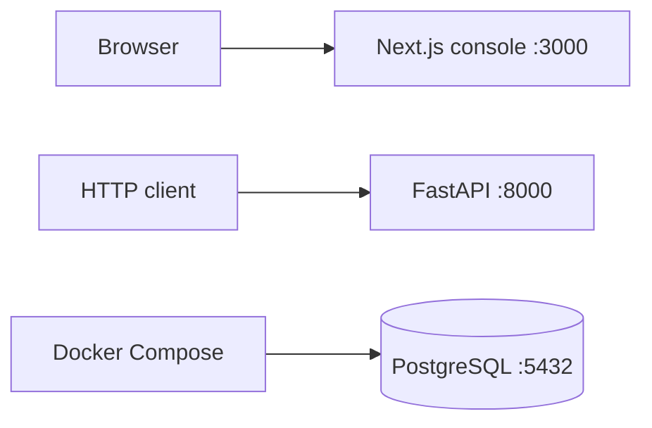
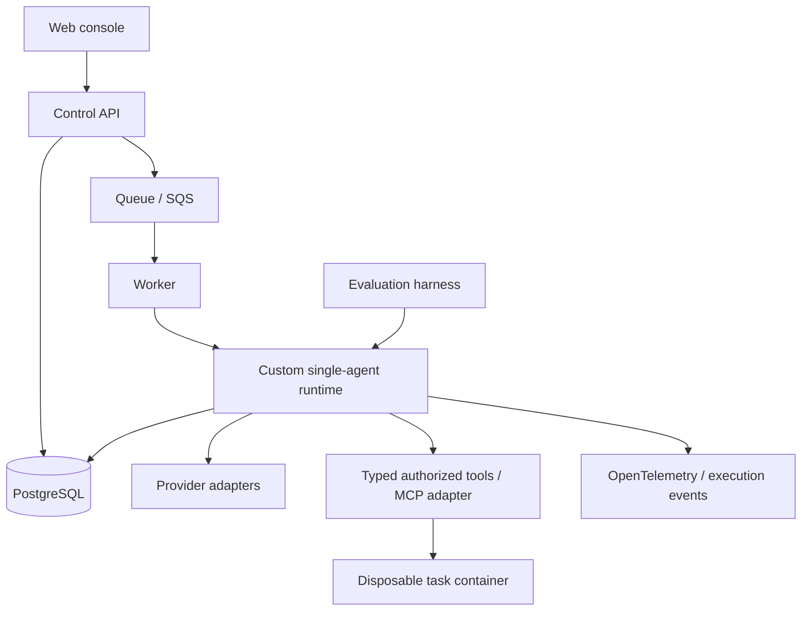

# Architecture

## Implemented in Phase 0

Both applications expose `GET /health` with a typed/structured service identity.
These endpoints report liveness. PostgreSQL has a separate Compose health check
and SQL smoke check; neither application depends on it yet. There is no web-to-API
request or CORS configuration until a feature needs one.

The root uv workspace locks Python dependencies in `uv.lock`; the API uses a src
layout and is installed as a real package. The npm workspace uses one root lockfile.
Python 3.12 and Node 24 are the initial supported interpreter lines. Explicit
minor-version adoption is preferred to untested claims of support for all future
Python versions. FastAPI/Pydantic and Next.js/React/TypeScript/Tailwind establish
the app boundaries. Ruff, strict mypy, ESLint, strict TypeScript, Prettier, pytest,
Vitest and process smoke checks form the quality baseline.

## Frozen initial boundaries

- Python backend; PostgreSQL is the future system of record.
- Build the runtime directly, initially for one agent per run.
- Next.js is the console; the runtime remains independent of UI concerns.
- Docker provides local dependencies and later controlled task environments.
- AWS is the deployment target, with Terraform managing infrastructure.
- No agent behavior, provider calls, tools, authentication or cloud deployment in Phase 0.

See [ADR 0001](docs/adr/0001-custom-runtime.md) and
[ADR 0002](docs/adr/0002-foundation-boundaries.md).

## Target architecture — not implemented

The API will accept work rather than run long tasks within an HTTP request.
Runtime domain code belongs in `packages/agent_core`; providers, tool execution,
evaluation and observability receive separate packages only when cohesive
implementations exist. `apps/worker` will own process/queue integration.
Dependency direction should point from apps and adapters toward domain contracts,
never from the domain toward FastAPI or Next.js.

PostgreSQL persistence, SQLAlchemy and Alembic arrive together in Phase 1.
Durability semantics, queue consistency, approvals and sandbox boundaries require
future ADRs and tests; the target diagram does not claim those properties exist.

## Open decisions

- Public product/repository name and license.
- Event ordering, checkpoint transaction boundaries and immutable version policy.
- Queue/database consistency and worker claim semantics.
- Sandbox threat model and AWS cost/deployment details.

These are reviewed in their relevant phase, not settled by empty abstractions.
