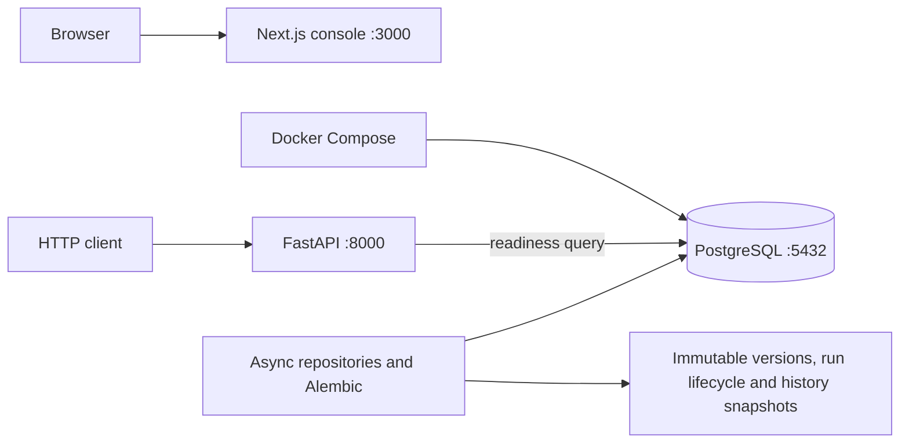
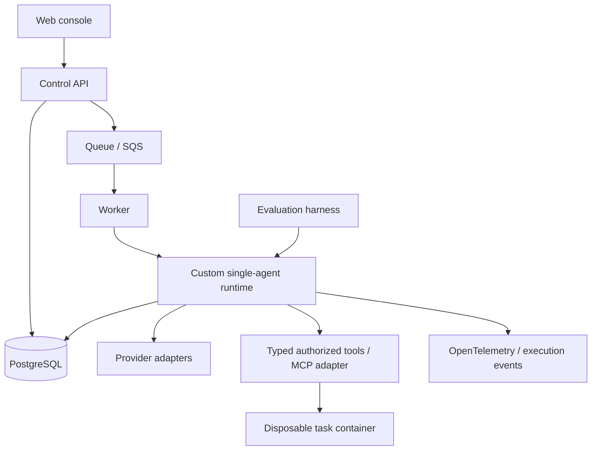

# Architecture

## Implemented through Phase 1B

Both applications expose `GET /health` with a typed/structured service identity.
These endpoints report liveness. The API also has `/ready`, a bounded database
connectivity probe. PostgreSQL has its own Compose health check. Schema migration
is an explicit operation. The web console remains the Phase 0 foundation; there
are no domain HTTP endpoints or web-to-API requests yet.

The root uv workspace locks Python dependencies in `uv.lock`; the API uses a src
layout and is installed as a real package. The npm workspace uses one root lockfile.
Python 3.12 and Node 24 are the initial supported interpreter lines. Explicit
minor-version adoption is preferred to untested claims of support for all future
Python versions. FastAPI/Pydantic and Next.js/React/TypeScript/Tailwind establish
the app boundaries. Ruff, strict mypy, ESLint, strict TypeScript, Prettier, pytest,
Vitest and process smoke checks form the quality baseline.

## Frozen initial boundaries

- Python backend; PostgreSQL is the future system of record.
- Build the runtime directly, initially for one agent per run.
- Next.js is the console; the runtime remains independent of UI concerns.
- Docker provides local dependencies and later controlled task environments.
- AWS is the deployment target, with Terraform managing infrastructure.
- No agent behavior, provider calls, tools, authentication or cloud deployment in Phase 0.

See [ADR 0001](docs/adr/0001-custom-runtime.md) and
[ADR 0002](docs/adr/0002-foundation-boundaries.md).

## Target architecture — not implemented

The API will accept work rather than run long tasks within an HTTP request.
Runtime domain code belongs in `packages/agent_core`; providers, tool execution,
evaluation and observability receive separate packages only when cohesive
implementations exist. `apps/worker` will own process/queue integration.
Dependency direction should point from apps and adapters toward domain contracts,
never from the domain toward FastAPI or Next.js.

Phase 1A adds `AgentDefinition`, immutable `AgentVersion` and `Run` snapshots in
`runveil_core`. Configuration is stored as opaque JSON without provider/tool
semantics. `runveil_persistence` owns SQLAlchemy mappings, psycopg async connections,
concrete repositories and Alembic migration 0001. The core imports neither the API
nor the persistence adapter. API lifecycle code owns and disposes its readiness engine.

Repository callers own transactions. Parent-row locks serialize version numbering;
run-row locks plus required expected revisions reject stale transitions. PostgreSQL
triggers enforce immutable versions and the same state graph as the domain. Store
creation, most recent transition, first start and terminal timestamps. See
[ADR 0003](docs/adr/0003-phase-1a-persistence.md) for the transition table and trade-offs.

Phase 1B adds immutable `RunStep`, `ExecutionEvent` and `Checkpoint` snapshots,
ORM tables and migration 0002. The run row serializes all repository boundary
writes. `record_step` checks both expected revision and event sequence, then writes
the step, two events and full checkpoint in the caller's transaction. Database
triggers append lifecycle events and assign event order, including direct SQL
lifecycle writes. Existing runs receive an explicitly incomplete snapshot baseline.
Read APIs use bounded cursor pagination and latest-checkpoint lookup. See
[ADR 0004](docs/adr/0004-execution-history.md) for the transaction and restore contract.

Checkpoint loading restores opaque versioned JSON state and its event watermark;
it does not resume execution. The current run may have advanced since that snapshot.
Model-invocation/tool-call records remain Phase 1C; providers, workers and execution
loops remain later phases. No new packages or HTTP routes were needed.

Queue consistency, approvals and sandbox boundaries still require future ADRs and
tests; the target diagram does not claim those properties exist.

## Open decisions

- Public product/repository name and license.
- Invocation/tool-call records and their execution-boundary correlation (Phase 1C).
- Queue/database consistency and worker claim semantics.
- Sandbox threat model and AWS cost/deployment details.

These are reviewed in their relevant phase, not settled by empty abstractions.
